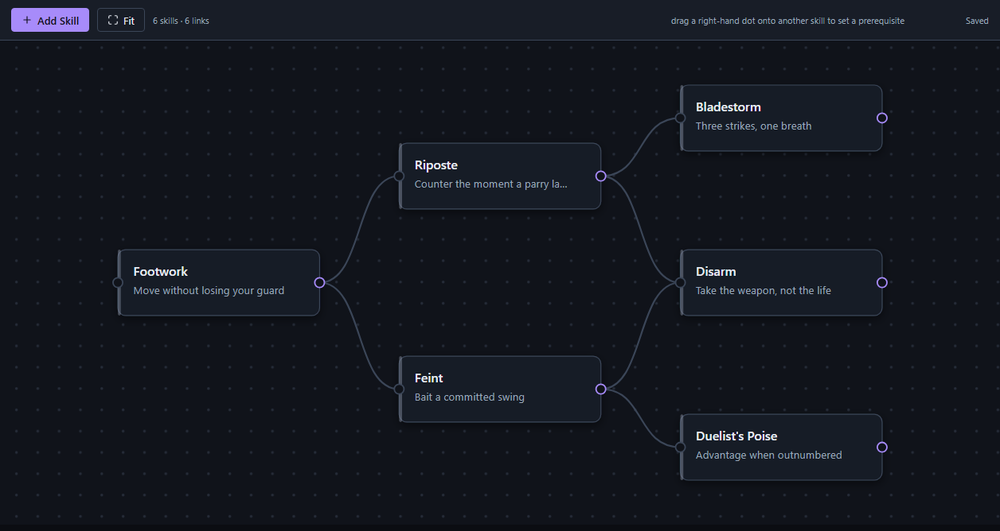

# 12 — THE PROJECT GATE: a skill-tree editor, shipped as a mod

**Sub-phase 5.3 · [`WO-P5-19`](workorders/WORKORDER-P5-19-tree-editor-screen.md) · the last work order in Project 5.**
**Built by the architect** at the PM's direction, 2026-08-03.

---

## 1. Did it work without touching the app?

```
$ git diff --stat HEAD -- src/ server/ packages/
$
```

**Empty. The gate passes.** The entire feature is two files in `mods/`:

| File | Lines |
|---|---|
| `mods/skill-tree.mod.json` | 29 |
| `mods/skill-tree.screen.js` | 690 |
| **total a mod author writes** | **719** |

Nothing in `src/`, `server/` or `packages/` was added, changed, or configured. The app does not know
this mod exists. **The claim the project was built to test — *"Eric's PR could have been a mod"* — holds.**

## 2. What it does

Add a skill, rename it, describe it, delete it. Drag it anywhere on an infinite canvas. Drag from a
node's output port onto another node to declare a prerequisite; click a link to remove it. Pan, zoom,
fit-to-content. **Prerequisite loops are rejected** with a reason, by walking the graph before the link
is committed. Everything persists to the mod's own table and survives a restart.

Rendered in SVG, coloured entirely from host `theme` tokens, with no npm package, no web font, no icon
library, and no network — inline SVG icons and a system font stack.

## 3. What was proven, and how

**In the running app** (`npm run dev`, Settings → Extensions):

- The frame mounted as `skill-tree.editor` with `sandbox="allow-scripts"` and **no `allow-same-origin`**.
- **Its height became exactly `660px`** — the value the screen asked for. That single fact proves three
  capabilities in sequence, because the screen `await`s them in order before it renders: `theme`, then
  `table.read`, then `resize`. A failure at any step would have faulted the frame and left the height
  untouched.
- No screen fault was recorded.

**In headless Edge**, driven over CDP with real mouse input:

- The editor renders the seeded tree (screenshot below).
- A real click on **Add Skill** produced **one `table.write` carrying 7 nodes where the table held 6** —
  `table.write` proven end to end, with zero faults.

**Uninstall:** `mods/skill-tree.*` deleted → `npm run build` clean, **2930 tests green**. Restored, still
green.

## 4. THE HONESTY LIST

Seven things that were awkward. This is the part worth reading.

### 4.1 `table.read` hands back whatever was stored, with no shape guarantee

The table declaration carries `recordShape: 'single-object'` and nothing else, so the screen receives
raw stored data. **I had to write `isNode()` and `isLink()` validators and filter every load**, because a
half-written table or a hand-edited file would otherwise crash the editor on mount. A schema on the table
declaration would let the host reject bad data before the mod ever sees it — the descriptor work in
PANELS already proved we can describe field shapes declaratively.

### 4.2 The screen cannot find out how much room it has

There is `resize` (screen → host) and no viewport report (host → screen). **I hardcoded `660`**, which is
a guess about a container I cannot measure. If the user resizes the settings modal, the screen never
learns. Inside the frame I can read my own `getBoundingClientRect`, so the canvas adapts — but the
frame's outer height is a number I invented rather than negotiated.

### 4.3 No signal that the table changed underneath the screen

R5 makes writes immediate with no journal, which is right for an interactive editor. But nothing tells
an open screen that a panel — or another screen — has just rewritten the same table. **The editor is
last-write-wins and cannot know it clobbered anything.** I debounce at 400ms, which narrows the window
and does not close it.

### 4.4 The theme has no interaction states

Seven colours, three font sizes, two radii — and no `surfaceHover`, no `accentMuted`, no shadow token.
**I derived hover and selection states from `rgba(255,255,255,.05)` overlays and a hand-rolled drop
shadow.** That works because this palette is dark. **On a light theme my derivations would look wrong**,
and the mod has no way to detect which it is: there is no `theme.mode`.

### 4.5 View state has nowhere to live

Pan and zoom reset on every mount, because the only storage a screen has is its own data table and
putting camera position in the skill tree pollutes the data with UI state. **A small per-screen scratch
store would be the right shape** and does not exist.

### 4.6 No way to see an error while building

If the screen throws, the user gets a fault chip. During development there is **no console** — the frame
is opaque and I cannot read anything out of it without deliberately posting a fault. **Debugging is
guess-and-check**, and I lost real time to it. A write-only log capability would not weaken isolation at
all.

### 4.7 A `</script>` in a screen's source silently kills the frame

Not a defect in the app — React sets `srcdoc` as an attribute, so the production path is safe. **But any
mod author who writes that character sequence in a string or comment breaks their own frame with no
error.** I hit it in my own screenshot harness within minutes. It belongs in modder documentation.

## 5. Was a fifth capability wanted?

**Needed to function: no.** The editor is complete on four.

**Wanted: yes, two.** A **viewport report** (§4.2) and a **log capability** (§4.6). Neither is a feature
the editor lacks; both are friction I worked around. The 5.2 executor's judgement that four suffice was
**correct as stated** — and "sufficient" is a lower bar than "comfortable."

## 6. ⚠️ A finding that outranks everything else here: **Arc does not load**

While running the app to test my screen, `GET /api/mods` returned:

```json
{ "file": "arc.mod.json",
  "reason": "compute.capabilities[0] names an unavailable read table \"mod.arc.arcs\"" }
```

**Arc — the COMPUTE gate's own artefact — is rejected by the mod loader at startup.**

`arc.mod.json` declares `table:read:mod.arc.arcs` and `table:write:mod.arc.arcs`. The validator checks
those against `COMPUTE_TABLE_READS = new Set(['archive','divergence','enemies','locations','npcs'])`
(`server/lib/modLoader.js:64`) — **a fixed allowlist of *host* tables with no concept of a mod's own
tables.** `git log -S "mod.arc.arcs" -- server/lib/modLoader.js` returns **nothing**: the allowlist has
never known about it. Arc has been rejected since the day it shipped as a mod.

**It is not mine.** `git diff --stat HEAD -- server/` is empty.

> ### This is the project's recurring failure, one more time: a guarantee tested on one path and not the other.
> `arc.test.ts` and `arcUninstall.test.ts` are green — **46 tests** — because they exercise the compute
> logic and the uninstall path **directly**. Neither goes through `modLoader.validateCapabilities`. The
> 3.7 gate proved Arc *works* as a mod. Nothing proved the loader would *accept* it.
>
> It is the same shape as `06_FACADE.md` §13 (store writes journalled, table writes not), and the same
> shape as `setModTable` never persisting. **We keep proving the half we wrote a test for.**

**Not fixed here, deliberately.** The fix is one line in `server/lib/modLoader.js`, and touching that
file would break §2's gate — the very thing this work order exists to demonstrate. **This is what a stop
condition is for.** It needs its own work order, and it should carry a test that loads every mod in
`mods/` through the real loader and asserts zero faults, so the next mod that fails validation fails a
suite instead of failing silently in production.

## 7. What it looks like



Node cards with the app's surface and border tokens, bezier connectors between ports, a dot grid that
pans and zooms with the content, accent-coloured output ports, and an inspector panel that appears on
selection. The palette is entirely the host's.

## 8. Verdict

**Project 5 — Block Architecture: the gate passes.**

A contributor can now ship a data table, a declared panel, a compute hook, **and a full custom UI**
without our source changing by one character. That was the bar, and it is met — with seven pieces of
recorded friction and one pre-existing defect that this work found only because building a mod meant
finally *running* the app instead of only testing it.
